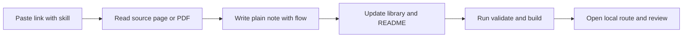
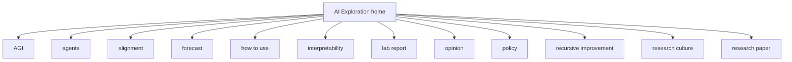

# AI Exploration

A calm personal hub for daily AI learning. Each pasted AI link becomes one short note in plain words, with the exact source kept at the bottom.

This repo starts with a Next.js site plus a file database. No external database is needed for now. A move to Supabase is planned only after about 200 to 400 notes.

## How it works

Paste one AI link in OpenCode with the `ai-exploration` skill. The skill reads the source with care, then adds:

- one markdown note in `content/entries`
- one record in `content/library.json`
- updated home listing, topic filters, and this README index
- local checks for build, validation, and lint



## Local start

```bash
npm install
npm run dev
```

Open `http://localhost:3000` for home, `http://localhost:3000/topics` for themes, and `/learn/your-slug` for one note.

## Add one link, the supported way

1. Open OpenCode in any session.
2. Invoke the global skill named `ai-exploration`.
3. Paste exactly one link from X, a lab blog, docs, arXiv, or a release page.
4. Review the new route under `/learn`.
5. Run `npm run validate`, `npm run build`, and `npm run lint` before sharing.

Anyone can suggest a link through a GitHub issue. Only the owner session with the skill adds rendered notes. See `CONTRIBUTING.md` for the issue format.

## Content style

Every note follows the same calm shape:

- What happened in 3 lines
- Why it matters for you
- Key points as short bullets
- Simple step flow with Mermaid when useful
- Terms explained in very simple words
- What to try next
- Exact source link

Notes use short sentences, plain words, no em dash, and no exclamation mark. Images need attribution. PDFs render inside the note page when a direct PDF link exists.

## Repo layout

- `app` holds home, topics, and `/learn/[slug]` routes
- `components` holds the Mermaid renderer and the PDF viewer
- `lib/library.ts` reads the file database and renders markdown
- `content/library.json` is the index for all notes
- `content/entries` holds one markdown file per note
- `public/images` holds attributed images by slug
- `scripts` holds validation and README generation

## PDF support

GitHub previews PDFs on its own. The site also embeds the source PDF with an `object` viewer on each note page when `pdf_url` is set. The full PDF text is not copied. Only a short summary is stored.

## Deployment

This app builds with `npm run build` and runs on Vercel or any Node host that supports Next.js 14.

Vercel settings:

- Framework preset: Next.js
- Build command: `npm run build`
- Output: default Next.js output
- Node: 22

## Roadmap

- Phase 1: file database in this repo, current phase
- Phase 2: keep file database until about 200 to 400 notes
- Phase 3: export `content/library.json` to Supabase on request, keep slugs and routes unchanged

## License

MIT. See `LICENSE`.

<!-- BEGIN AUTO -->

Total notes: 9

### Topics

| Topic | Notes | Link |
| --- | --- | --- |
| agents | 2 | [Open notes](/?topic=agents) |
| AGI | 2 | [Open notes](/?topic=AGI) |
| alignment | 1 | [Open notes](/?topic=alignment) |
| forecast | 2 | [Open notes](/?topic=forecast) |
| how to use | 1 | [Open notes](/?topic=how%20to%20use) |
| interpretability | 1 | [Open notes](/?topic=interpretability) |
| lab report | 3 | [Open notes](/?topic=lab%20report) |
| opinion | 1 | [Open notes](/?topic=opinion) |
| policy | 3 | [Open notes](/?topic=policy) |
| recursive improvement | 1 | [Open notes](/?topic=recursive%20improvement) |
| research culture | 1 | [Open notes](/?topic=research%20culture) |
| research paper | 1 | [Open notes](/?topic=research%20paper) |
| safety | 1 | [Open notes](/?topic=safety) |
| science | 1 | [Open notes](/?topic=science) |
| security | 1 | [Open notes](/?topic=security) |
| start here | 1 | [Open notes](/?topic=start%20here) |
| superintelligence | 3 | [Open notes](/?topic=superintelligence) |

### Recent notes

- 2026-09-18 [Inside the plan for the DeepMind Institute](/learn/2026-09-18-introducing-deepmind-institute) (Google DeepMind)
- 2026-09-18 [Calls grow for a science of the AI mind](/learn/2026-09-18-wsj-science-of-the-ai-mind) (WSJ Opinion)
- 2026-09-18 [DeepMind Institute opens a home for AGI thinking](/learn/2026-09-18-deepmind-institute-home) (Google DeepMind)
- 2026-09-18 [Welcome to AI Exploration](/learn/2026-09-18-welcome-to-ai-exploration) (AI Exploration)
- 2026-09-16 [OpenAI shares a plan for reporting model misalignment](/learn/2026-09-18-openai-misalignment-reporting-framework) (OpenAI)
- 2026-09-14 [Dream RSI teaches agents to improve how they explore](/learn/2026-09-18-dream-rsi-recursive-exploration) (arXiv)
- 2026-07-09 [AI 2040 Plan A argues for a verified slowdown](/learn/2026-09-18-ai-2040-plan-a) (AI Futures Project)
- 2025-04-03 [AI 2027 sketches one fast path to superintelligence](/learn/2026-09-18-ai-2027-scenario) (AI Futures Project)
- 2024-06-01 [The Project predicts a government run AGI effort](/learn/2026-09-18-situational-awareness-the-project) (Leopold Aschenbrenner)

### Site map



<!-- END AUTO -->
