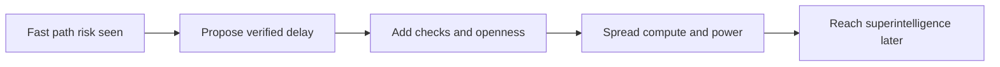

## What happened in 3 lines

- The same team released AI 2040 Plan A as a proposal, not a forecast.
- The plan asks the US and China to slow superintelligence to 2040.
- The direct site had load issues here, so this note uses project posts.

## Why it matters for you

- You see the shift from prediction to advice.
- You learn what verified slowdown could mean in practice.
- You can compare race, slowdown, and plan paths side by side.

## Key points

- AI 2027 warned of fast takeoff and race strain.
- AI 2040 Plan A picks delay plus checks and shared power.
- The plan calls for more lab openness.
- The plan spreads compute and control across groups.
- Authors say the path is hard but worth aiming for.
- Critics still debate timing, cost, and control odds.

## Simple flow

## Terms explained

- Verified slowdown means pausing speed with checks all sides can see.
- Plan A means the preferred advice path in this project.
- Takeoff means the phase when AI skill rises very fast.

## What to try next

- Open the about page for method and author list.
- Read one Plan A chapter on desktop for best view.
- List one pro and one con of delay.

## Exact source

- https://ai-2040.com/
