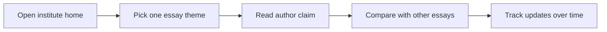

## What happened in 3 lines

- Google DeepMind opened the DeepMind Institute site.
- The hub hosts essays on AGI safety, policy, and future society.
- Pieces reflect author views, not formal Google policy.

## Why it matters for you

- You get lab side thinking in longer form than blog posts.
- You can follow five launch themes in one place.
- You can track how safety views shift over time.

## Key points

- Launch essays cover reason transparency and AGI policy.
- More essays cover utopian aims and frontier testing.
- Authors include Legg, Manyika, Hassabis, and more.
- The hub invites debate across tech and society.
- The disclaimer marks pieces as discussion starters.

## Simple flow

## Terms explained

- AGI means a system with broad human level cognitive skill.
- Reasoning transparency means keeping model thought steps open to checks.
- Frontier AI means the most capable models now in test or use.

## What to try next

- Start with the intro essay, then one theme essay.
- Note where authors agree and where they differ.
- Save the essays page for weekly review.

## Exact source

- https://institute.deepmind.com/
