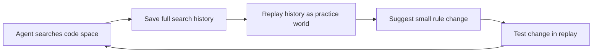

## What happened in 3 lines

- Researchers shared Dream RSI, a way for coding agents to search better over time.
- The direct PDF link did not render as text here, so this note uses the arXiv page.
- The core idea is to train the explore plan, then reuse past runs as practice worlds.

## Why it matters for you

- Agents often fail from weak search, not weak coding skill.
- Better explore plans can save time and compute on long tasks.
- The method leaves the base coding agent unchanged, which is easy to adopt.

## Key points

- Fixed search plans break as tasks grow more complex.
- Online tuning is costly since each test run takes long.
- Dream RSI adds a small control layer above the agent.
- Past search trees become replay worlds for cheap tests.
- A model suggests small edits to the explore rules.
- Scores reward good finds and punish too many tries.
- The loop targets discovery speed across hard domains.

## Simple flow

## Terms explained

- Exploration policy means the rules for where to look next.
- Rollout means one full run of tries toward an answer.
- Replay means reusing old runs to test new rules at low cost.
- Meta search means searching for better search rules.

## What to try next

- Open the arXiv abstract page and check the method figure.
- Compare with AlphaEvolve style solution search.
- Ask how replay cost scales with task length.

## Exact source

- https://www.dream-rsi.com/assets/dream-rsi.pdf
