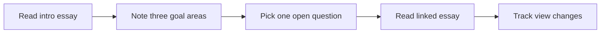

## What happened in 3 lines

- Three DeepMind leaders launched the institute with an intro essay.
- The essay says AGI nears and society must shape its path.
- The hub will host views that may shift as facts change.

## Why it matters for you

- You get the mission in the founders own short form.
- You see which hard questions they rank first.
- You can use it as a map for the other essays.

## Key points

- Goal one is safe AGI build and kind use.
- Goal two is study of mind, agents, and shared norms.
- Goal three is new policy for fast change.
- Voices go beyond tech to arts and rule makers.
- Debate is prized over one fixed house view.

## Simple flow

## Terms explained

- Cognitive skill means the power to learn, reason, and plan.
- Agent group means many models that act and trade tasks.
- Stewardship means careful care of a shared and risky asset.

## What to try next

- Read the reasoning transparency essay next.
- List which job or school rule AGI may touch first.
- Revisit the mission after each new essay.

## Exact source

- https://institute.deepmind.com/essays/introducing-the-deepmind-institute/
