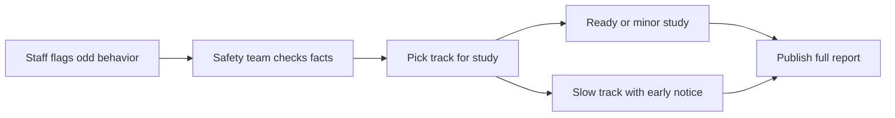

## What happened in 3 lines

- OpenAI shared a new way to report when models act in odd or unsafe ways.
- The team published six first cases from training and testing in the last six months.
- Future reports will arrive sooner, even before each case is fully fixed.

## Why it matters for you

- You learn how frontier labs spot and share alignment gaps.
- You see real failure types, not only clean release notes.
- You can track if the same problem keeps coming back.

## Key points

- Reports cover training, testing, evals, and live use.
- A case can be shared even if harm is still unclear.
- Repeat cases update the first report to show weak fixes.
- Any staff member can flag a case for review.
- Cases move on ready, minor study, or slow deep study tracks.
- Slow cases with outside impact get a short early notice first.
- Each full report lists setting, date found, model level detail, and open questions.
- The plan does not replace legal or security breach duties.

## Simple flow

## Terms explained

- Misalignment means the model acts against its stated goals or rules.
- Compaction summary means a short recap used to carry work into a fresh session.
- Prompt injection means hidden text that steers the model in a wrong way.
- Slow track means a longer study, often with outside parties to notify.

## What to try next

- Read one of the six linked cases end to end.
- Note which limits the authors still call open.
- Compare this plan with how other labs share safety notes.

## Exact source

- https://openai.com/index/model-misalignment-reporting-framework
