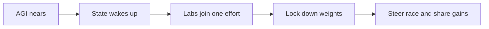

## What happened in 3 lines

- This essay is part four of the Situational Awareness series.
- It claims startups alone cannot hold superintelligence with care.
- It predicts a US led project by around 2027 or 2028.

## Why it matters for you

- You see why labs may merge into a defense style effort.
- You learn the chain of command worry in plain form.
- You can link this old call to newer slowdown plans.

## Key points

- Superintelligence is framed as a key defense asset.
- Private labs face theft, rush, and weak control risks.
- A joint lab plus cloud plus state model is proposed.
- Security needs vetting, closed nets, and safe sites.
- Safety needs time for tests during fast change.
- Civilian uses can still grow after the risky phase.
- Allies may pool chips, talent, and rules.

## Simple flow

## Terms explained

- SCIF means a closed room built for secret work.
- Weights theft means copying the core model files to a rival.
- Nonproliferation means rules that stop spread to more states or groups.

## What to try next

- Read parts one to three for compute and security setup.
- Compare with AI 2040 Plan A on state role.
- Note which 2027 calls now look early or late.

## Exact source

- https://situational-awareness.ai/the-project
