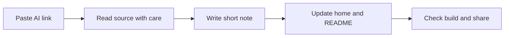

## What happened in 3 lines

- This site collects daily AI news in one calm place.
- Each link gets a short note in plain words.
- You can read the note first and open the source next.

## Why it matters for you

- Long lab posts take time to read.
- Short notes help you review fast each day.
- Topics help you track models, agents, and alignment over time.

## Key points

- Every note keeps the exact source link at the bottom.
- Every note uses short sentences and short bullets.
- Every note adds a simple flow when the topic has steps.

## Simple flow

## Terms explained

- Source link means the exact page where the news came from.
- Slug means the short address used for the note page.
- Topic means a label like agents, models, or alignment.

## What to try next

- Open Topics and pick one theme to follow.
- Send a new AI link through a GitHub issue.
- Compare one note with its exact source each week.

## Exact source

- https://github.com/aniruddhaadak80/ai-exploration
